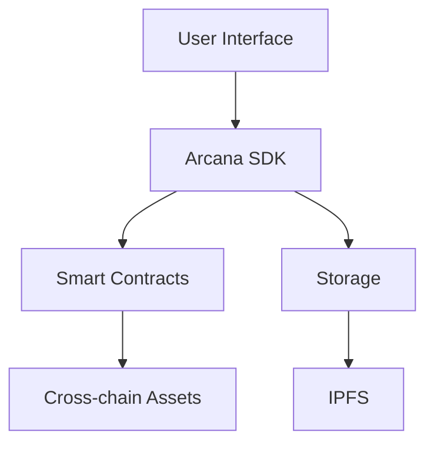

# Digital Will dApp Documentation

## Table of Contents
1. [Overview](#overview)
2. [System Architecture](#system-architecture)
3. [Setup Guide](#setup-guide)
4. [Smart Contract Integration](#smart-contract-integration)
5. [Arcana SDK Integration](#arcana-sdk-integration)
6. [Security Features](#security-features)
7. [User Guide](#user-guide)
8. [API Reference](#api-reference)
9. [Troubleshooting](#troubleshooting)

## Overview

The Digital Will dApp is a decentralized application for creating and managing digital asset inheritance using blockchain technology. It leverages Arcana Network's SDK for simplified cross-chain operations and enhanced privacy.

### Key Features
- Cross-chain asset management
- Privacy-preserving beneficiary system
- Two-phase timelock mechanism
- Social recovery options
- Encrypted storage
- User-friendly interface

## System Architecture

### Components
1. **Smart Contracts**
   - DigitalWill.sol: Main contract managing will logic
   - Integration with Arcana Auth and Storage

2. **Frontend**
   - React-based UI
   - Arcana SDK integration
   - Web3 connectivity

3. **Backend Services**
   - Arcana Gateway
   - IPFS storage
   - Cross-chain bridges



## Setup Guide

### Prerequisites
- Node.js v14+
- NPM or Yarn
- MetaMask or compatible wallet

### Installation

1. Install dependencies:
```bash
npm install @arcana/auth @arcana/storage @arcana/auth-react
npm install ethers hardhat @openzeppelin/contracts
```

2. Environment setup:
```env
ARCANA_APP_ID=your_app_id
ARCANA_GATEWAY_URL=your_gateway_url
PRIVATE_KEY=your_deployment_key
```

3. Smart contract deployment:
```bash
npx hardhat compile
npx hardhat deploy --network scroll
```

## Smart Contract Integration

### Contract Initialization
```solidity
constructor(address _arcanaAuth, address _arcanaStorage) {
    arcanaAuth = IArcanaAuth(_arcanaAuth);
    arcanaStorage = IArcanaStorage(_arcanaStorage);
}
```

### Key Functions

1. **Will Creation**
```solidity
function setWill(
    bytes32[] calldata _encryptedBeneficiaries,
    uint256[] calldata _percentages,
    string calldata _assetsDataIPFS,
    uint256 _timelockPeriod,
    bytes32 _did
) external nonReentrant
```

2. **Beneficiary Acceptance**
```solidity
function acceptBeneficiaryRole(
    address willCreator,
    bytes32 _beneficiaryHash,
    bytes32 _did,
    string calldata _encryptedDataIPFS
) external
```

## Arcana SDK Integration

### Authentication Setup
```typescript
const auth = new AuthProvider(process.env.ARCANA_APP_ID);
await auth.init();
```

### Storage Implementation
```typescript
const storage = new StorageProvider(process.env.ARCANA_APP_ID);
await storage.init();

// Upload encrypted data
const encrypted = await storage.encrypt(data);
const ipfsHash = await storage.upload(encrypted);
```

## Security Features

### 1. Timelock System
- Initial inactivity period
- 6-month secondary timelock
- Heartbeat mechanism

### 2. Privacy Measures
- Zero-knowledge proofs
- Encrypted beneficiary data
- Private metadata

### 3. Access Control
- DID-based authorization
- Granular permissions
- Multi-signature support

## User Guide

### Creating a Will

1. Connect wallet and authenticate
2. Specify assets and beneficiaries
3. Set timelock parameters
4. Confirm and deploy

### Beneficiary Management

1. Add beneficiaries
2. Set allocation percentages
3. Manage notifications
4. Update preferences

### Recovery Process

1. Initiate recovery
2. Verify identity
3. Complete secondary timelock
4. Claim assets

## API Reference

### EnhancedDigitalWillService

#### Methods

```typescript
async initialize(): Promise<void>
```
Initializes the service with Arcana SDK.

```typescript
async createWill(
    beneficiaries: Beneficiary[],
    assets: WillAsset[],
    timelockPeriod: number
): Promise<TransactionReceipt>
```
Creates or updates a digital will.

```typescript
async acceptBeneficiaryRole(
    willCreator: string,
    beneficiaryHash: string,
    did: string
): Promise<TransactionReceipt>
```
Accepts role as beneficiary.

### Event Handling

```typescript
interface WillEvent {
    creator: string;
    timestamp: number;
    eventType: 'CREATE' | 'MODIFY' | 'EXECUTE';
}

service.on('willCreated', (event: WillEvent) => {
    // Handle will creation
});
```

## Troubleshooting

### Common Issues

1. **Transaction Failures**
   ```typescript
   try {
       await service.createWill(beneficiaries, assets);
   } catch (error) {
       if (error.code === 'TIMELOCK_ACTIVE') {
           // Handle timelock error
       }
   }
   ```

2. **Authentication Issues**
   - Check Arcana app ID configuration
   - Verify wallet connection
   - Confirm network settings

3. **Storage Problems**
   - Verify IPFS gateway status
   - Check encryption parameters
   - Confirm storage permissions

### Error Codes

| Code | Description | Solution |
|------|-------------|----------|
| AUTH_001 | Authentication failed | Reconnect wallet |
| STORE_001 | Storage error | Check IPFS connection |
| WILL_001 | Invalid parameters | Verify input data |
| TIME_001 | Timelock active | Wait for expiry |

### Support Channels

- GitHub Issues: [Repository Link]
- Discord: [Community Channel]
- Email: support@digitalwill.example.com

## Best Practices

1. **Security**
   - Regular security audits
   - Multiple recovery options
   - Secure key management

2. **Performance**
   - Batch transactions
   - Optimistic updates
   - Efficient data structures

3. **User Experience**
   - Clear error messages
   - Progressive disclosure
   - Intuitive workflows

## Contributing

1. Fork the repository
2. Create feature branch
3. Submit pull request
4. Follow coding standards

## License

MIT License - see LICENSE.md

---

*Last updated: February 2025*
